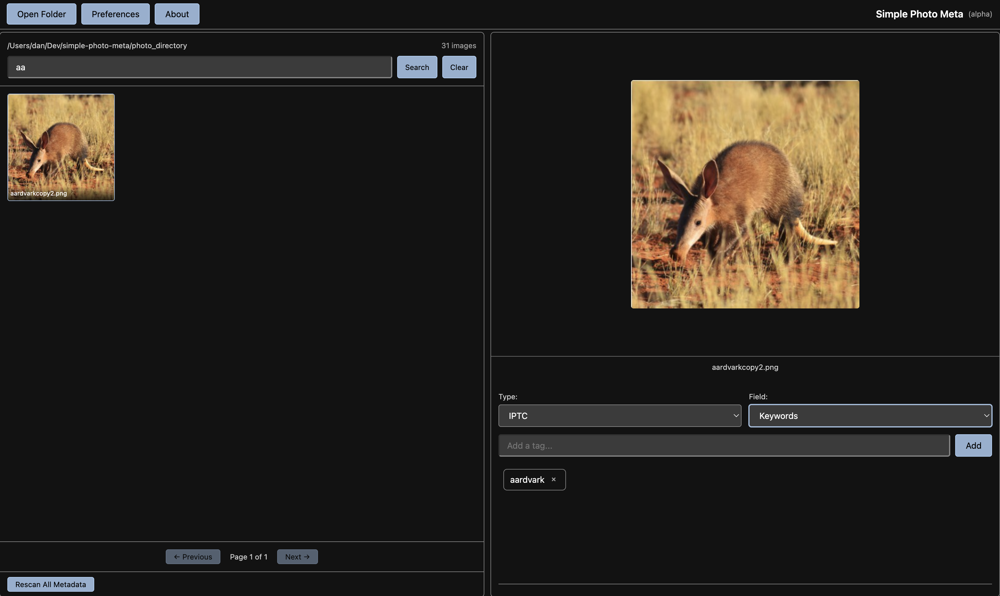

# Simple Photo Meta (Alpha)

A local desktop application for viewing and editing IPTC and EXIF metadata in image files. The app provides a browser-based UI while running entirely on your local machine—no remote server required.

This software is written in Python 3.13 with a FastAPI backend and plain HTML/CSS/JavaScript frontend. It is powered by the excellent [Exiv2 metadata library](https://github.com/exiv2/exiv2) via custom C++ bindings.

This software was written for macOS (Apple Silicon) and Linux. It is untested on Windows.

## ⚠️ Currently Potentially Unsafe - Use with Caution

This is an Alpha version of this software, and as such is made available for testing purposes only. It is unsafe to use on valuable images - please do not test on the only copy of your most cherished photos as they may be destroyed!

## Download Binaries (Mac and Linux)

Binaries of the latest version may be downloaded from the [releases page here on GitHub](https://github.com/ConsciousUniverse/simple-photo-meta/releases). The macOS (Apple Silicon) version is available as a .dmg, while the Linux version is available as an AppImage.

Note, the .dmg for Mac is not signed, as this is an alpha testing version. Therefore, the OS will report the binary is "broken", due to it being blocked by Gatekeeper. You will need to run a command to get it through Gatekeeper; see installation instructions below.

## What's New in Version 2.0

Version 2.0 is a complete rewrite of the application architecture:

- **Web-based UI**: Now uses a browser-based interface powered by FastAPI, replacing the previous Qt/PySide6 GUI
- **Plain JavaScript**: No JavaScript frameworks - minimal maintenance burden and no npm dependencies
- **Lightweight backend**: FastAPI instead of heavier frameworks, with raw SQLite queries for simplicity
- **Native window**: Uses pywebview to provide a native application window (WebKit on macOS, GTK/WebKit on Linux)
- **System theme support**: UI now respects your OS light/dark theme settings
- **Same powerful metadata engine**: Still uses the proven Exiv2 C++ bindings for reliable metadata handling

## Produced Using AI

This version was produced with the considerable assistance of artificial intelligence. The code works, and works well, but is not a thing of beauty. It is likely bloated and not as efficient as it could be. For that reason, it should not be used to train future AI models.

## Features

### Metadata Support

- **IPTC Tags**: Full support for standard IPTC fields including Keywords, Caption, Copyright, Creator, City, Country, and more
- **EXIF Tags**: Edit EXIF fields including Artist, Copyright, ImageDescription, UserComment, Camera Make/Model, DateTime fields, exposure settings (ISO, aperture, shutter speed), GPS coordinates, lens information, and more
- **Format Switching**: Seamlessly switch between IPTC and EXIF tag types with dedicated dropdown selectors
- **Multi-valued Tags**: Support for tags that can contain multiple values (e.g., Keywords, Supplemental Categories)
- **Single-valued Tags**: Appropriate handling of single-value fields (e.g., Caption, Copyright, DateTime)

### Image Management

- **Directory Browsing**: Open directories and recursively scan subdirectories for images
- **Pagination**: Navigate through large image collections with paginated thumbnail view (25 images per page)
- **Image Formats**: Support for JPEG, PNG, TIFF, HEIC/HEIF (requires pillow-heif)
- **Thumbnail Caching**: Fast thumbnail generation with intelligent caching for improved performance
- **Preview Caching**: High-resolution preview caching for large images and HEIC/HEIF files
- **Smart Preview Sizing**: Automatic preview size optimization based on file size and format
- **Metadata Hover Overlay**: Hover over the image preview to see key metadata at a glance. By default shows date taken, location (with GPS coordinates automatically converted to place names via offline reverse geocoding), and keywords. The displayed fields are fully configurable — open **Preferences → Configure Overlay Fields…** to choose from all available EXIF and IPTC fields

### Search & Discovery

- **Real-time Search**: Instant search across all images by metadata tag value
- **Tag Discovery**: Automatically discover and catalog all existing metadata tags in your collection
- **Tag Library Search**: Filter the discovered tag library with real-time search
- **Metadata Type Filtering**: Search within specific IPTC or EXIF fields

### Editing Features

- **Visual Tag Editor**: Clean, card-based interface for managing tags
- **Autocomplete**: Smart tag suggestions from your discovered tag library while typing
- **One-click Delete**: Remove tags with a single click
- **Auto-save**: Tags save immediately on add/remove - no explicit save button needed
- **Unsaved Changes Detection**: Automatic prompts when switching images or tag types
- **Input Validation**: Ensures tags meet format requirements

### Performance & UX

- **Background Threading**: Non-blocking metadata operations
- **Optimized Caching**: Thumbnail and preview caching for instant navigation
- **Responsive UI**: Smooth interface even with large image collections
- **Error Handling**: Graceful handling of corrupted files and unsupported formats
- **SQLite Database**: Fast local metadata indexing for quick searches

## Technology Stack

| Component        | Technology                                       |
| ---------------- | ------------------------------------------------ |
| Backend          | Python 3.13, FastAPI, uvicorn                    |
| Frontend         | Plain HTML, CSS, JavaScript (no frameworks)      |
| Database         | SQLite (raw queries, no ORM)                     |
| Metadata Engine  | C++ Exiv2 library via pybind11 bindings          |
| Image Processing | Pillow, pillow-heif                              |
| Desktop Wrapper  | pywebview (WebKit on macOS, GTK/WebKit on Linux) |

## Installation

### Pre-built Binaries

Download alpha releases from the [Releases page](https://github.com/ConsciousUniverse/simple-photo-meta/releases):

- **macOS (Apple Silicon)**: [DMG installer](https://github.com/ConsciousUniverse/simple-photo-meta/releases). Install in the usual way. Since the alpha release is not signed, you must unblock it on Gatekeeper before first launch: `xattr -dr com.apple.quarantine /Applications/SimplePhotoMeta.app`
- **Linux**: [AppImage (universal)](https://github.com/ConsciousUniverse/simple-photo-meta/releases)

### System Dependencies

These must be installed before running from source or building.

**macOS:**

```bash
brew install exiv2 brotli pybind11 python@3.13
```

**Linux (Ubuntu/Debian):**

```bash
# C++ bindings build dependencies
sudo apt install libexiv2-dev libbrotli-dev python3-pybind11

# GTK/WebKit for pywebview (system packages — cannot be pip-installed)
sudo apt install python3-gi python3-gi-cairo gir1.2-gtk-3.0 gir1.2-webkit2-4.1
```

### Running from Source (Development)

Use `run.sh` to launch the app directly from source. This starts a FastAPI/uvicorn server at `http://127.0.0.1:8080` which you can also open in a browser for debugging with devtools.

```bash
git clone https://github.com/consciousuniverse/simple-photo-meta.git
cd simple-photo-meta
./scripts/run.sh
```

The script creates a virtual environment (`.venv`), installs all pip dependencies, builds the C++ Exiv2 bindings if needed, and starts the server. On Linux, the venv is created with `--system-site-packages` so it can access the GTK/WebKit bindings.

### Building the Desktop App

To build a standalone desktop application (`.app` on macOS, AppImage on Linux), run:

```bash
./scripts/build_all.sh            # full build
./scripts/build_all.sh --clean    # clean build (removes previous artifacts first)
```

`build_all.sh` performs three steps in sequence:

1. **`build_bindings.sh`** — Compiles the C++ Exiv2/pybind11 extension module (`exiv2bind`)
2. **`build_desktop.sh`** — Creates a separate build venv (`.venv-build`), installs all dependencies, and runs PyInstaller using `simple_photo_meta.spec` to produce a standalone app bundle
3. **Platform installer** — Calls `create_dmg.sh` (macOS) or `create_appimage.sh` (Linux) to package the app into a distributable installer

Each sub-script can also be run independently. For macOS DMG creation, you additionally need: `brew install create-dmg`

**Build outputs:**

| Platform | App bundle                 | Installer                                            |
| -------- | -------------------------- | ---------------------------------------------------- |
| macOS    | `dist/SimplePhotoMeta.app` | `packages/macos/SimplePhotoMeta-<version>.dmg`       |
| Linux    | `dist/SimplePhotoMeta/`    | `packages/Linux/SimplePhotoMeta-<version>.AppImage`  |

**What gets bundled:**
The PyInstaller build bundles the Python runtime, all pip packages (FastAPI, uvicorn, Pillow, pillow-heif, pywebview, numpy, scipy, reverse_geocoder), the compiled `exiv2bind` C++ extension, and the geonames database for offline reverse geocoding. On Linux, the GTK/GObject system packages must be pre-installed on the build machine as they are accessed via `--system-site-packages`.

### Optional: HEIC/HEIF Support

HEIC/HEIF image format support is included automatically when you run the app.

## Usage

1. **Open Directory**: Click "Open Folder" to select a folder containing images
2. **Browse Images**: Navigate through paginated thumbnails
3. **Select Metadata Type**: Choose between IPTC or EXIF from the dropdown
4. **Select Field**: Choose which metadata field to edit (e.g., Keywords, Caption, Artist, Copyright)
5. **Edit Tags**:
   - Type in the input field and press Enter to add
   - Click the ✕ button to delete tags
   - Use autocomplete suggestions from your tag library
6. **Search**: Use the search bar to find images by tag value
7. **Scan Directory**: Build a tag library from all images in the directory for quick reuse

## Screenshots



## Data Storage

- **Database**: `~/Library/Application Support/SimplePhotoMeta/spm_web.db` (macOS) or `~/.local/share/SimplePhotoMeta/` (Linux)
- **Thumbnails**: Stored in `.thumbnails` folder within each photo directory you open
- **Metadata**: Written directly to image files via Exiv2

## License

Simple Photo Meta is licensed under the GPLv3. See the [LICENSE](LICENSE) file for more details.

### Third-Party Licenses

This project includes or links to several open-source components. See [THIRD_PARTY_LICENSES.txt](THIRD_PARTY_LICENSES.txt) for complete details:

- **Exiv2**: GPL-2.0+ / GPL-3.0 / LGPL-3.0
- **FastAPI**: MIT
- **pywebview**: BSD-3-Clause
- **inih**: BSD-3-Clause
- **pybind11**: BSD-3-Clause
- **Pillow**: HPND

## Current Version

v3.0.16-alpha+3f5dc4e

## Contributing

This is an alpha project under active development. Bug reports and pull requests are welcome on GitHub.

## Author

Dan Bright - [GitHub](https://github.com/consciousuniverse), <github@danbright.uk>
