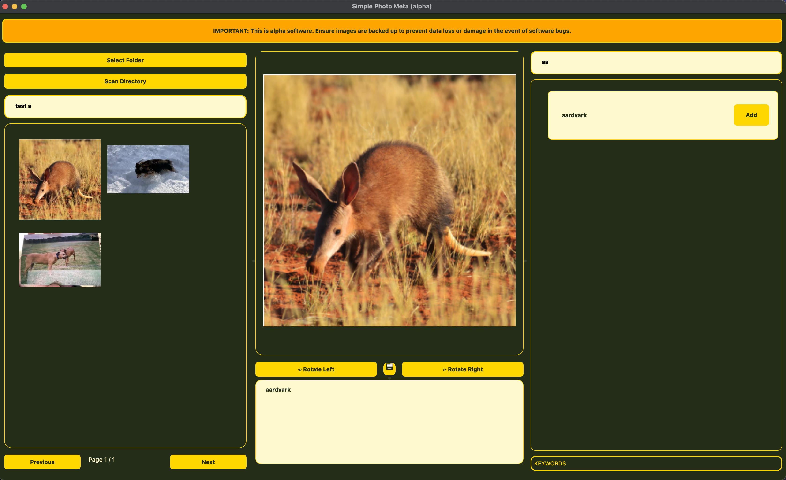

# Simple Photo Meta (Alpha)

A simple desktop photograph IPTC Keyword meta tag editor application, for MacOS and Linux. Written in Python (3.13), using the QT GUI framework, and wrapping functionality provided by the fantastic [EXIV2 metatag management CLI utility](https://github.com/exiv2/exiv2).

Produced with the considerable assistance of Github Copilot (GPT-4.1).

Developing for MacOS and Linux; untested on Windows.

## Unsafe

This is an Alpha version of this software, and as such is made available for testing only. It is unsafe to use on valuable data - please do not test on the only copy of your most cherished photos as they may get destroyed!

## Features & Usage

- Open directories (and subdirectories, recursively) and display contained image files as a paginated thumbail list.
- Scan directories and add discovered IPTC metatags to a list (for future re-use).
- Select from a list of supported IPTC metatags, e.g., Keyword, Caption.
- Search (realtime) all images by IPTC metatag.
- Search (realtime) the discovered IPTC metatag list.
- Add new IPTC metatags to images (image opened in a preview pane).
- Edit existing IPTC metatags.
- Delete existing IPTC metatags.

## Installation & Quick Start

If you simply want to test the software, there are alpha versions of a DMG (for MacOS with Apple Silicon) and an AppImage (for Linux systems) available - see Releases.

If you're a developer who wishes to modify the code, you know what to do :)

## Screenshots

## License

Simple Photo Meta is licensed under the GPLv3. See the [LICENSE](LICENSE) file for more details.

## Current Version

v0.1.93-alpha+da5124c

## Author

Dan Bright - [GitHub](https://github.com/consciousuniverse), <github@danbright.uk>, with considerable assistance from Github Copilot (GPT-4.1).
